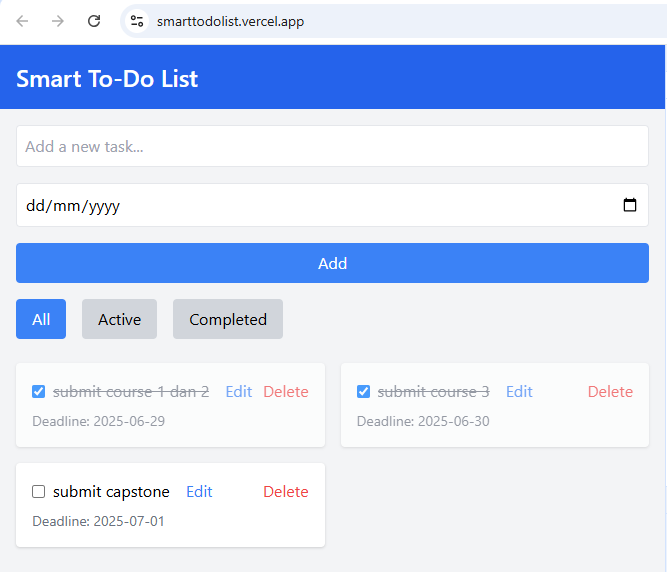
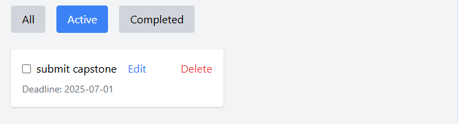
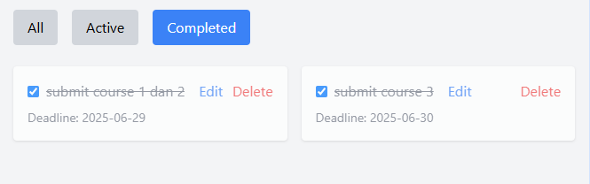

# Smart To-Do List

A minimal and intelligent task management web app built using **HTML**, **Tailwind CSS**, and **Vanilla JavaScript**.

## 🔍 Project Overview

**Tujuan Proyek:**  
Membuat aplikasi produktivitas sederhana yang cerdas, memungkinkan pengguna mencatat, menyelesaikan, dan memfilter tugas harian secara efisien tanpa backend.

**Latar Belakang:**  
Banyak aplikasi to-do yang terlalu kompleks atau mengharuskan pengguna login. Aplikasi ini menawarkan solusi instan yang ringan namun tetap fungsional, cocok untuk mahasiswa, profesional, dan pengguna umum.

**Permasalahan:**  
Bagaimana membangun aplikasi ringan yang mendukung deadline, filtering status, dan penyimpanan lokal, tanpa kompleksitas server atau database?

**Pendekatan:**  
- Menggunakan HTML, Tailwind CSS, dan JavaScript murni  
- Menyimpan data menggunakan `localStorage`  
- Membuat UI responsif dan interaktif dengan fitur filter, deadline, dan edit langsung

---

## 🛠 Technologies Used

- **HTML5** – struktur semantik
- **Tailwind CSS** – styling responsif dan utility-first
- **JavaScript (Vanilla)** – logika aplikasi tanpa framework
- **LocalStorage API** – menyimpan data secara offline dalam browser

**Alasan Pemilihan:**  
Teknologi ini ringan, cepat dikembangkan, tidak memerlukan backend, serta cocok untuk deployment ke layanan statis seperti Netlify atau Vercel.

---

## ✨ Features

- ✅ **CRUD**: Tambah, Edit, Hapus, dan Tandai tugas selesai
- ⏰ **Deadline Support**: Tugas yang melewati tenggat otomatis ditandai sebagai selesai
- 🔍 **Filter Status**: Tampilan berdasarkan All / Active / Completed
- 💾 **Penyimpanan Lokal**: Data disimpan secara otomatis ke localStorage
- 📱 **Responsif**: Antarmuka optimal untuk desktop maupun mobile
- 🧠 **Inline Editing**: Klik pada teks tugas untuk mengedit langsung

**Cara Kerja:**  
- Tambah tugas lewat form dengan tanggal opsional  
- Sistem akan memeriksa tanggal hari ini dan menandai tugas yang lewat deadline  
- Filter dapat dipilih untuk melihat tugas aktif atau selesai  
- Semua data tersimpan secara lokal tanpa login

---

## 🧭 Cara Mengoperasikan Aplikasi

### 1. Menambahkan Tugas Baru
- Ketik deskripsi tugas di kolom "Add a new task..."
- (Opsional) Pilih tanggal deadline
- Klik tombol "Add"
- Tugas akan muncul di daftar

### 2. Menandai Tugas Selesai
- Klik checkbox di samping tugas
- Tugas akan diberi efek coretan dan dianggap selesai

### 3. Mengedit Tugas
- Klik langsung pada teks tugas
- Teks menjadi editable, tekan Enter untuk menyimpan

### 4. Menghapus Tugas
- Klik tombol “Delete” di samping tugas
- Tugas akan langsung dihapus

### 5. Filter Tugas (All / Active / Completed)
- Klik tombol filter untuk mengubah tampilan tugas

### 6. Deadline
- Tugas yang melewati deadline dan belum ditandai selesai akan otomatis dicoret

### 7. Penyimpanan Otomatis
- Semua data disimpan dengan localStorage tanpa login

---

## 🚀 Setup Instructions

1. **Clone repo** atau **unduh `index.html`**
2. Buka `index.html` di browser (Chrome/Edge/Firefox)
3. Gunakan aplikasi secara langsung – tidak perlu instalasi atau server

---

## 🤖 AI Support (IBM Granite)

**Bagaimana AI Membantu:**  
- Menghasilkan struktur dasar CRUD dan UI interaktif  
- Memberikan saran desain UX untuk deadline dan filtering  
- Merekomendasikan refactoring & validasi logika update task  
- Mempercepat debugging saat pengembangan dan pengujian

**Dampak Nyata:**  
- Mempercepat pengembangan sekitar **80% lebih cepat**  
- Mengurangi jumlah bug dan inkonsistensi antarmuka  
- Membantu memahami pendekatan modular pada frontend logic

> Catatan: AI **tidak digunakan di aplikasi akhir**, hanya saat fase pengembangan.

---

## 📸 Screenshots
- 📋 Form input & tanggal deadline  

- ✅ Tugas selesai & auto-cross 

---

## 🔗 Live Demo

- 🌐 [Lihat versi live di Vercel](https://smarttodolist.vercel.app/)
- 💻 [GitHub Repository](https://github.com/antsig/SmartToDoList-IBMGranite.git)

---

Made with 💙 for the Student Development Initiative  
by **Hacktiv8 x IBM SkillsBuild**  
#Hacktiv8 #IBMSkillsBuild #IBMGranite #VanillaJS #ToDoApp #TailwindCSS #AIEnhancedDev 
